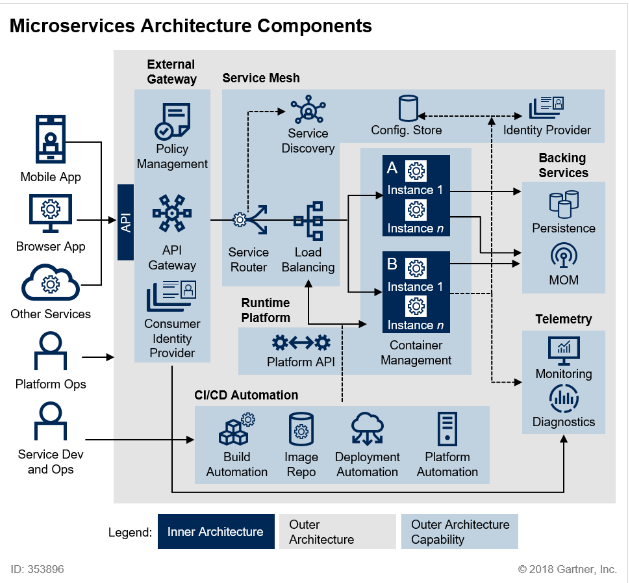
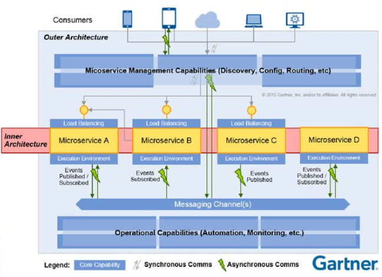

# MSA
- `Micro Services Architecture`의 약어로 소프트웨어 개발 기법 중 하나
- AWS, GCP, Azure, OCI 등의 클라우드 시스템으 제공하는 기업들에서 출시되는 애플리케이션은 거의 MSA를 위해 맞춰가고 있음

## Monolithic Architectrue
- 소프트웨어의 모든 구성요소가 한 프로젝트에 통합되어있는 형태로 유지보수가 용이
- ### 문제점
    - 프로젝트가 커지면 커질수록 영향도 파악 및 전체 시스템 구조의 파악이 어려움
    - 프로젝트가 커지면 빌드 시간 및 테스트 시간, 배포 시간이 기하급수적으로 늘어남
    - 서비스를 부분적으로 `scale out`하기 어려움
    - 부분적인 장애가 전체 서비스의 장애로 이어질 수 있음
- `Monolitic Architecture`의 문제점을 해결하기 위해 `MSA` 도입

## MSA란?
- 전체 서비스를 특정 목적을 가진 서비스 단위로 나누어 변경과 조합이 가능하도록 만든 아키텍쳐
- 나누어진 서비스는 크기가 작을 뿐 하나의 `Monolitic Architectrue`와 유사한 구조
- 각각의 서비스는 다른 서비스에 대한 의존성이 최소화 되어야함
- API를 사용하여 통신
- 서비스를 독립적으로 배포 가능

### 장점
- 서비스 별 개별 배포 가능
- 특정 서비스에 대한 확장성이 용이
- 부분적 장애에 대한 처리가 수월

### 문제점
- 한 트랜잭션 처리 및 각각의 애플리케이션 에러에 대한 처리가 필요
- 서비스 숫자가 많아지고 복잡해질수록 테스트가 어려워짐
- `Monolitic Architecture`에 비해 네트워크 레이턴시와 트래픽이 증가
- 배포에 대한 자동화가 필수
- 각각의 서비스의 데이터 무결성을 책임지지 못함

## 아키텍쳐 구성

### Innter Architectrue

- 내부 서비스와 관련된 아키텍쳐
- 고려사항
    1. 서비스를 어떻게 정의할 것인가?
        - 서비스를 정의하기 위해 고려해야 할 사항은 비지니스 뿐만 아니라 서비스간의 종속성, 배포 용이성, 장애 대응, 운영 효율성 등이 있음
    2. DB Access 구조를 어떻게 설계할 것인가?
        - 일부 비지니스 트랜잭션은 여러 Microservice를 걸쳐 있기 때문에 각 서비스에 연결된 DB의 정합성을 보장할 방안이 필요
    3. 서비스 내의 `API`를 어떻게 설계한 것인가?
    4. 논리적인 컴포넌트들의 `Layer`를 어떠한 방식으로 설계할 것인가?

### Outer Architectrue
1. #### External Gateway
    - 전체 서비스 외부로부터 들어오는 접근을 내부 구조를 드러내지 않고 처리하기 위한 요소
    - 사용자 인증과 권한 정책관리를 수행하며 `API Gateway`가 여기서 가장 핵심적인 역할을 담당
    - `API Gateway`는 서버 가장 앞단에 위치하여 모든 `API` 호출을 받고 받은 `API` 호출을 인증한 후, 적절한 서비스들에 메시지를 전달될 수 있도록 함(Routing)
2. #### Service Mesh
    - 마이크로서비스 구성 요소간의 네트워크를 제어하는 역할
    - 서비스간에 통신을 하기 위해서는 `Service Discovery`, `Service Routing`, 트래픽 관리 및 보안 등을 담당하는 요소가 필요한데 `Service Mesh`는 이 기능들을 모두 수행
3. #### Container Management
    - `Kubernetes` 등을 사용하여 컨테이너를 관리
4. #### Backing Service
    - 애플리케이션이 실행되고 있을때 네트워크를 통해 사용할 수 있는 모든 서비스(e.g. DB, cache system, SMTP ...)
    - `MSA`의 특징적인 `Backing Service` 중의 하나는 `Message Queue`로 `MSA`에서는 메시지 송신자와 수신자가 직접 통신하지 않고 `Message Queue`를 통해 비동기적으로 통신하는 것을 지향
    - `MSA`에서는 데이터 변경, 트랜잭션과 관련된 처리는 `Message Queue`를 활용한 비동기 처리가 효율적
5. #### Telemetry
    - 분산되어있는 서비스들을 모니터링하고 서비스별로 발생하는 이슈들에 대응할 수 있도록 환경을 구성해줌
6. #### CI/CD Automation
    - 지속적인 통합(Continuous Integration), 지속적인 전달(Continuous Delivery), 지속적인 배포(Continuous Deployment)를 담당

## API Gateway
- API 서버의 앞단에서 모든 API 서버들의 엔드포인트를 단일화 해주는 서버
- API에 대한 인증/인가 기능을 가지고 있으며 메시지의 내용에 따라 애플리케이션 내부에 있는 마이크로 서비스로 라우팅해주는 역할을 담당

### API Gateway의 필요성
- `MSA`는 큰 서비스를 잘게 쪼개어 개발/운영하는 아키텍쳐
- 하나의 큰 서비스는 수십~수백개의 작은 서비스로 나누어지며 이를 클라이언트에서 서비스를 직접 호출하는 형태면 문제가 발생
    - 각각의 서비스마다 인증/인가 등 공통된 로직을 구현해야하는 번거로움이 있음
    - 수많은 API 호출을 기록하고 관리하기 어려움
    - 클라이언트에서 여러 마이크로 서비스에 대한 번거로운 호출을 해야함
    - 내부의 비지니스 로직이 드러나게 되어 보안에 취약해짐

### API Gateway의 주요 기능
1. #### 인증 및 인가(Authentication and Authorization)
    - `MSA`의 각각의 서비스의 API 호출에 대한 인증 및 인가를 하려면 같은 코드를 서비스 인스턴스들마다 심어야함
    - 이러한 이유로 인증서 관리, 인증, SSL, 프로토콜 변환과 같은 기능들은 `API Gateway`에서 오프로드함으로써 서비스의 부담을 줄이고 서비스의 관리 및 업그레이드를 보다 쉽게 할 수 있음
2. #### 요청 절차의 단순화
    - `API Gateway`가 없다면 클라이언트에서 여러 서비스들에 대한 요청을 해야함
    - `API Gateway`는 여러 클라이언트의 요청을 단일 클라이언트의 요청으로 대체 가능하도록 해줌
3. #### 라우팅 및 로드 밸런싱
    - `API Gateway`는 클라이언트로부터 접수된 메시지에 따라 `API` 호출을 적절한 서비스에 라우팅할 수 있음
    - 서비스 인스턴스들에 대한 로드밸런싱 가능
4. #### 서비스 오케스트레이션
    - 여러 마이크로 서비스들을 묶어 새로운 서비스를 만드는 개념
    - 오케스트레이션 로직을 과도하게 넣는 것은 `API Gateway`의 부담이 늘어나 성능 저하가 발생할 수 있으므로 적절히 해야함
5. #### 서비스 디스커버리
    - `API Gateway`는 각 서비스를 호출하기 위해 서비스마다 IP주소와 포트번호를 알고 있어야함
    - 서비스의 위치(IP주소와 포트번호)를 찾는 역할을 담당

### API Gateway 적용시 고려할 사항
- `Scale out` 적용이 유연하지 않으면 `API Gateway`에 병목현상이 발생해 애플리케이션의 성능저하가 발생할 수 있음
- `API Gateway`라는 추가적인 `Layer`가 만들어지는 것이기 때문에 네트워크 `Latency`가 증가